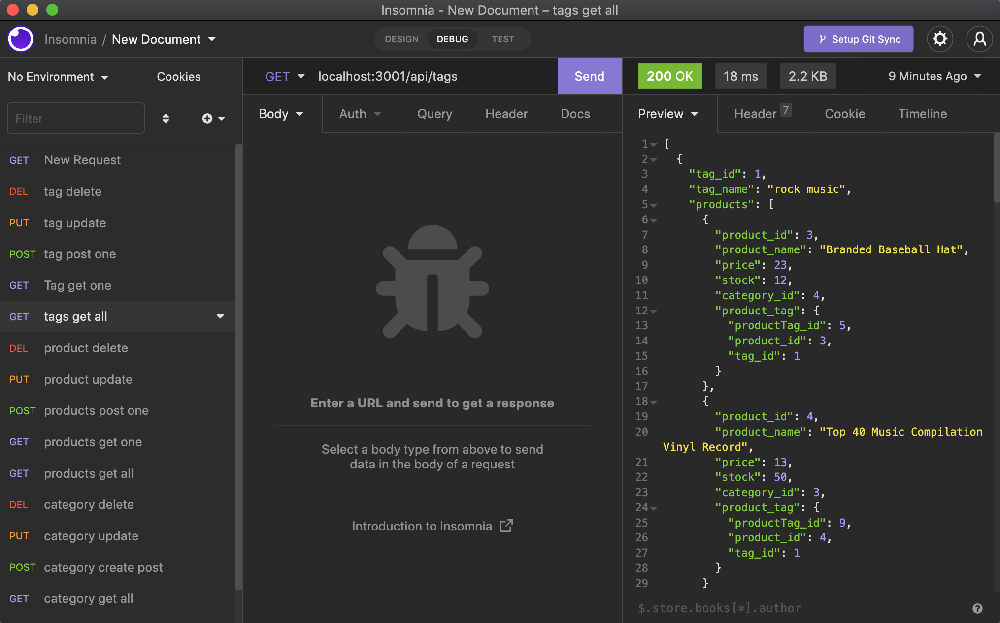
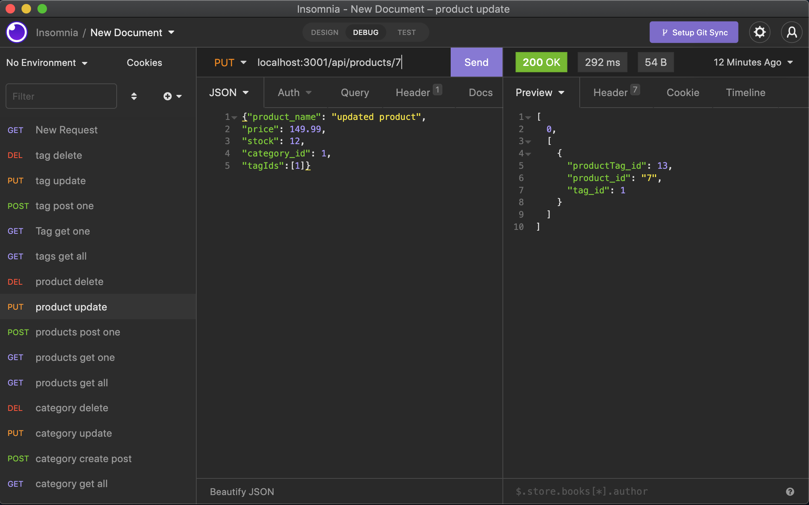

# E-Commerce BackEnd(ORM)

## Summary
this project uses express and sequelize technologies to interact with the MySQL database. API routes and models were created to perform RESTful CRUD operations to navaigate the database that was given.
 

## Technologies 
* JavaScript
* Node.js
* Express.js
* MySQL
* Sequelize
* Insomnia

## installation
to use this application node.js, express.js, and sequelize must be installed. first you must connect to database by typing `mysql -u root -p` in your terminal which will prompt you to type in your password. once you connect to database you must seed your data using `npm run seed`. Once complete, connect to server using `npm start`.

## Usage
open insomnia and begin by using CRUD operations and utilizing the routes which will allow the user to:

- Create category/product/tag
- Get all categories/product/tag
- Get a single category/product/tag
- Update a category/product/tag
- Delete a category/product/tag

## Preview 

[Demo Walkthrough](https://youtu.be/1OXCz94EXoY)

